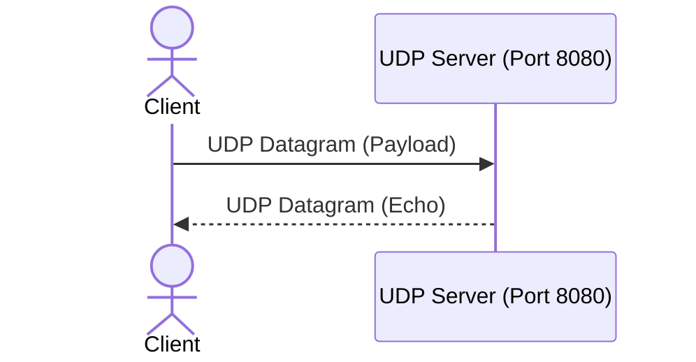

# MDViewer ⚡

A blazing-fast, lightweight Markdown Editor & Viewer built with **Rust** for Windows.

## 🚀 Features

- **Direct File Opening**: Open any `.md` file directly from Windows Explorer via `Open with...` or command-line arguments (`mdviewer.exe "file.md"`).
- **Zero Bloat**: Built purely in **Rust** using Windows native WebView2 (Edge Chromium engine). **No Electron**, **No Python**, minimal RAM usage, instant startup.
- **Single Self-Contained `.exe`**: All HTML/CSS/JS/diagram engines are embedded directly into the binary at compile time.
- **Three Viewing Modes**:
  - `Preview Mode`: Clean rendered reader view (auto-activates when opening files).
  - `Split Mode`: Live editor on the left with instant synchronized preview on the right.
  - `Edit Mode`: Full-width distraction-free code/text editor.
- **Diagram Engines Built-in**:
  - **UDP / Network Protocol Diagrams**: Render RFC 768 UDP headers, TCP headers, IPv4 headers, and custom packet/bitfield specifications into crisp vector SVGs!
  - **Mermaid Diagrams**: Sequence diagrams (UDP request/reply, TCP handshakes), flowcharts, class diagrams, state diagrams.
- **Full Markdown Support**:
  - Headings with auto IDs
  - GitHub-style Alerts (`> [!NOTE]`, `> [!TIP]`, `> [!IMPORTANT]`, `> [!WARNING]`, `> [!CAUTION]`)
  - Styled Responsive Tables
  - Code blocks with one-click **Copy** button
  - Task lists `[x]`
  - Dark Mode / Light Mode toggle
  - Print / Export to PDF
- **Editor Features**:
  - Line numbers
  - Tab indentation support (2 spaces)
  - Unsaved modifications indicator (`● Unsaved` / `✓ Saved`)
  - Word count, line count, cursor position tracker
  - Native file dialogs for Open, Save, and Save As

---

## ⚡ UDP & Packet Diagram Syntax

### 1. RFC ASCII Format (Automatic SVG conversion)

````markdown
```udp
 0                   1                   2                   3
 0 1 2 3 4 5 6 7 8 9 0 1 2 3 4 5 6 7 8 9 0 1 2 3 4 5 6 7 8 9 0 1
+-+-+-+-+-+-+-+-+-+-+-+-+-+-+-+-+-+-+-+-+-+-+-+-+-+-+-+-+-+-+-+-+
|          Source Port          |       Destination Port        |
+-+-+-+-+-+-+-+-+-+-+-+-+-+-+-+-+-+-+-+-+-+-+-+-+-+-+-+-+-+-+-+-+
|            Length             |           Checksum            |
+-+-+-+-+-+-+-+-+-+-+-+-+-+-+-+-+-+-+-+-+-+-+-+-+-+-+-+-+-+-+-+-+
|                             data                              |
+-+-+-+-+-+-+-+-+-+-+-+-+-+-+-+-+-+-+-+-+-+-+-+-+-+-+-+-+-+-+-+-+
```
````

### 2. Packet DSL Format

````markdown
```packet
title: User Datagram Protocol Header (RFC 768)
width: 32
0-15: Source Port [color=#3b82f6]
16-31: Destination Port [color=#8b5cf6]
32-47: Length (octets) [color=#10b981]
48-63: Checksum [color=#f59e0b]
64-95: Application Payload Data [color=#64748b]
```
````

### 3. Mermaid Sequence Diagram (UDP Communication)

````markdown

````

---

## ⌨️ Keyboard Shortcuts

| Shortcut | Action |
| :--- | :--- |
| `Ctrl + S` | Save current file |
| `Ctrl + Shift + S` | Save As... |
| `Ctrl + O` | Open file dialog |
| `Ctrl + N` | New blank document |
| `Ctrl + P` | Toggle between Preview and Split view |
| `Ctrl + E` | Toggle between Edit and Split view |

---

## 🛠️ Windows File Association & Setup

1. Run `register_md_association.bat` to:
   - Add **Open with MDViewer** to the right-click menu for all files.
   - Associate `.md` files so double-clicking any markdown file opens MDViewer directly.
2. To remove association, simply run `unregister_md_association.bat`.

---

## 🏗️ Build from Source

### One-Click Build Script
Double-click [build.bat](file:///E:/__pTSern/.tools/mdviewer/build.bat) to automatically:
- Close any active `mdviewer.exe` process (preventing file locks)
- Compile an optimized release executable
- Present a quick-launch menu to run the app or register associations

### Manual CLI
```bash
# Debug build
cargo build

# Optimized release binary
cargo build --release
```

Binary location: `target\release\mdviewer.exe`
