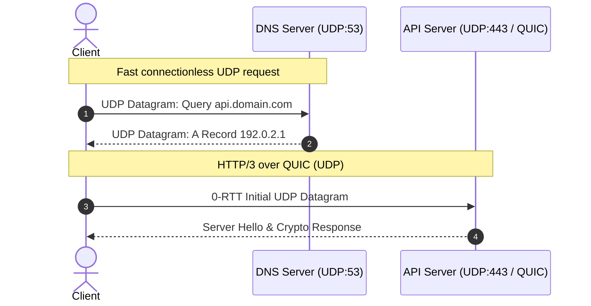

# Welcome to MDViewer

A high-performance, lightweight Markdown editor and viewer built with **Rust** for Windows.

> [!NOTE]
> MDViewer direct opens `.md` files, renders Markdown, and includes built-in diagram renderers for **UDP / Network Protocol headers** and **UML (Mermaid)**!

---

## ⚡ UDP Datagram Header (RFC 768)

Below is the standard RFC 768 User Datagram Protocol (UDP) packet layout:

```udp
 0                   1                   2                   3
 0 1 2 3 4 5 6 7 8 9 0 1 2 3 4 5 6 7 8 9 0 1 2 3 4 5 6 7 8 9 0 1
+-+-+-+-+-+-+-+-+-+-+-+-+-+-+-+-+-+-+-+-+-+-+-+-+-+-+-+-+-+-+-+-+
|          Source Port          |       Destination Port        |
+-+-+-+-+-+-+-+-+-+-+-+-+-+-+-+-+-+-+-+-+-+-+-+-+-+-+-+-+-+-+-+-+
|            Length             |           Checksum            |
+-+-+-+-+-+-+-+-+-+-+-+-+-+-+-+-+-+-+-+-+-+-+-+-+-+-+-+-+-+-+-+-+
|                             data                              |
+-+-+-+-+-+-+-+-+-+-+-+-+-+-+-+-+-+-+-+-+-+-+-+-+-+-+-+-+-+-+-+-+
```

### UDP Fields Summary

| Field | Size | Description |
| :--- | :--- | :--- |
| **Source Port** | 16 bits | Port number of the sending process |
| **Destination Port** | 16 bits | Port number of the receiving process |
| **Length** | 16 bits | Length in octets of the header and data |
| **Checksum** | 16 bits | 16-bit one's complement checksum |

---

## 📊 UDP Sequence Diagram (Mermaid)

Demonstration of UDP vs TCP communication flows:



---

## 📦 Custom Packet DSL Specification

You can also specify arbitrary packet / bitfield headers using simple syntax:

```packet
title: Custom Telemetry Packet
width: 32
0-7: Version [color=#3b82f6]
8-15: Message Type [color=#8b5cf6]
16-31: Sequence ID [color=#10b981]
32-63: High-Resolution Timestamp [color=#f59e0b]
64-95: Telemetry Payload
```

---

## ⚙️ Key Features

- **Open With Integration**: Set MDViewer as default `.md` editor or use "Open with...".
- **Three Modes**:
  - `Preview`: Clean rendered view (perfect when opening files).
  - `Split`: Live editor on the left, synchronized preview on the right.
  - `Edit`: Full-width distraction-free writing.
- **Keyboard Shortcuts**:
  - `Ctrl + S`: Save file
  - `Ctrl + Shift + S`: Save As
  - `Ctrl + O`: Open file
  - `Ctrl + N`: New file
  - `Ctrl + P`: Toggle Preview mode
  - `Ctrl + E`: Toggle Edit mode
