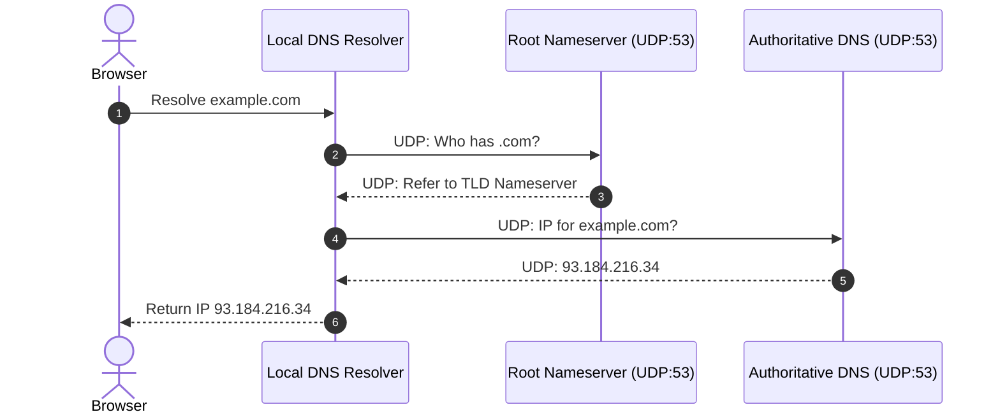

# Network Protocol Analysis: User Datagram Protocol (UDP)

The **User Datagram Protocol** (UDP) is defined in [RFC 768](https://www.rfc-editor.org/rfc/rfc768). It provides a connectionless, unreliable datagram service on top of the Internet Protocol (IP).

---

## 1. UDP Datagram Format

```udp
 0                   1                   2                   3
 0 1 2 3 4 5 6 7 8 9 0 1 2 3 4 5 6 7 8 9 0 1 2 3 4 5 6 7 8 9 0 1
+-+-+-+-+-+-+-+-+-+-+-+-+-+-+-+-+-+-+-+-+-+-+-+-+-+-+-+-+-+-+-+-+
|          Source Port          |       Destination Port        |
+-+-+-+-+-+-+-+-+-+-+-+-+-+-+-+-+-+-+-+-+-+-+-+-+-+-+-+-+-+-+-+-+
|            Length             |           Checksum            |
+-+-+-+-+-+-+-+-+-+-+-+-+-+-+-+-+-+-+-+-+-+-+-+-+-+-+-+-+-+-+-+-+
|                             data                              |
+-+-+-+-+-+-+-+-+-+-+-+-+-+-+-+-+-+-+-+-+-+-+-+-+-+-+-+-+-+-+-+-+
```

---

## 2. DNS Query / Response Flow over UDP



---

## 3. High-Performance UDP Socket in Rust

Here is a non-blocking asynchronous UDP server implementation in Rust:

```rust
use std::net::SocketAddr;
use tokio::net::UdpSocket;

#[tokio::main]
async fn main() -> Result<(), Box<dyn std::error::Error>> {
    let addr = "127.0.0.1:8080".parse::<SocketAddr>()?;
    let socket = UdpSocket::bind(&addr).await?;
    println!("UDP Server listening on: {}", addr);

    let mut buf = [0u8; 1024];

    loop {
        // Receive datagram and client address
        let (len, client_addr) = socket.recv_from(&mut buf).await?;
        println!("Received {} bytes from {}", len, client_addr);

        // Echo response back over UDP
        let response = b"ACK: Datagram received successfully";
        socket.send_to(response, &client_addr).await?;
    }
}
```

---

## 4. Python UDP Client Script

Here is an example client sending DNS or telemetry packets:

```python
import socket
import struct
import time

def send_udp_packet(host: str, port: int, payload: bytes) -> None:
    sock = socket.socket(socket.AF_INET, socket.SOCK_DGRAM)
    sock.settimeout(2.0)
    
    try:
        start_time = time.time()
        sock.sendto(payload, (host, port))
        data, server = sock.recvfrom(1024)
        elapsed_ms = (time.time() - start_time) * 1000
        print(f"[UDP] Received {len(data)} bytes from {server} in {elapsed_ms:.2f}ms")
    except socket.timeout:
        print("[ERROR] UDP Datagram request timed out!")
    finally:
        sock.close()

if __name__ == "__main__":
    send_udp_packet("127.0.0.1", 8080, b"PING: Test Datagram")
```

---

## 5. Packet Metadata (JSON Payload)

```json
{
  "protocol": "UDP",
  "version": 4,
  "sourcePort": 5353,
  "destinationPort": 53,
  "checksumValid": true,
  "length": 42,
  "flags": {
    "broadcast": false,
    "fragmented": false
  }
}
```

---

## 6. Comparison with TCP Header

```packet
title: Transmission Control Protocol Header (RFC 793)
 0                   1                   2                   3
 0 1 2 3 4 5 6 7 8 9 0 1 2 3 4 5 6 7 8 9 0 1 2 3 4 5 6 7 8 9 0 1
+-+-+-+-+-+-+-+-+-+-+-+-+-+-+-+-+-+-+-+-+-+-+-+-+-+-+-+-+-+-+-+-+
|          Source Port          |       Destination Port        |
+-+-+-+-+-+-+-+-+-+-+-+-+-+-+-+-+-+-+-+-+-+-+-+-+-+-+-+-+-+-+-+-+
|                        Sequence Number                        |
+-+-+-+-+-+-+-+-+-+-+-+-+-+-+-+-+-+-+-+-+-+-+-+-+-+-+-+-+-+-+-+-+
|                    Acknowledgment Number                      |
+-+-+-+-+-+-+-+-+-+-+-+-+-+-+-+-+-+-+-+-+-+-+-+-+-+-+-+-+-+-+-+-+
|  Data |           |U|A|P|R|S|F|                               |
| Offset| Reserved  |R|C|S|S|Y|I|            Window             |
|       |           |G|K|H|T|N|N|                               |
+-+-+-+-+-+-+-+-+-+-+-+-+-+-+-+-+-+-+-+-+-+-+-+-+-+-+-+-+-+-+-+-+
|           Checksum            |         Urgent Pointer        |
+-+-+-+-+-+-+-+-+-+-+-+-+-+-+-+-+-+-+-+-+-+-+-+-+-+-+-+-+-+-+-+-+
```

> [!TIP]
> Notice how the UDP header is only **8 bytes** (64 bits), whereas the TCP header is at least **20 bytes** (160 bits)! This makes UDP significantly faster for real-time applications like DNS, VoIP, gaming, and HTTP/3 QUIC.
